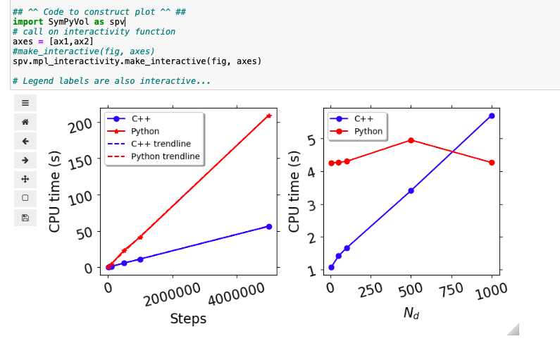

# SymPyVolume
Command line 3-D Plotting tool derived from [SymPy](https://www.sympy.org/en/index.html) and [IPyVolume](https://ipyvolume.readthedocs.io/en/latest/).

## Still a work in progress...


# Installation

1. Clone the Repo to your github directory 

2. Create an alias in bashrc for the plot.py script:

```bash
alias plot='python "$home"/github/SymPyVolume/plot.py'
```

You're all set. Checkout the help page for more information


## [Examples (click here)](https://robraddi.github.io/SymPyVolume/index.html)


### Usage:

```bash
optional arguments:
  -h, --help            show this help message and exit
  --Fn <class 'str'>    Function with variables x,y,z
  --x X                 x-axis limits
  --y Y                 y-axis limits
  --z Z                 z-axis limits
  --axis-labels AXIS_LABELS
                        axis labels for plot
  --data DATA           input data file
```

### Requirements (most recent versions):
```bash
scipy
sympy
ipyvolume
ipywidgets
```

### Other usage (for matplotlib interactivity):




------------------


## TODO:

- be able to embed sliders inside the html plot (see ipyvolume.widgets)


